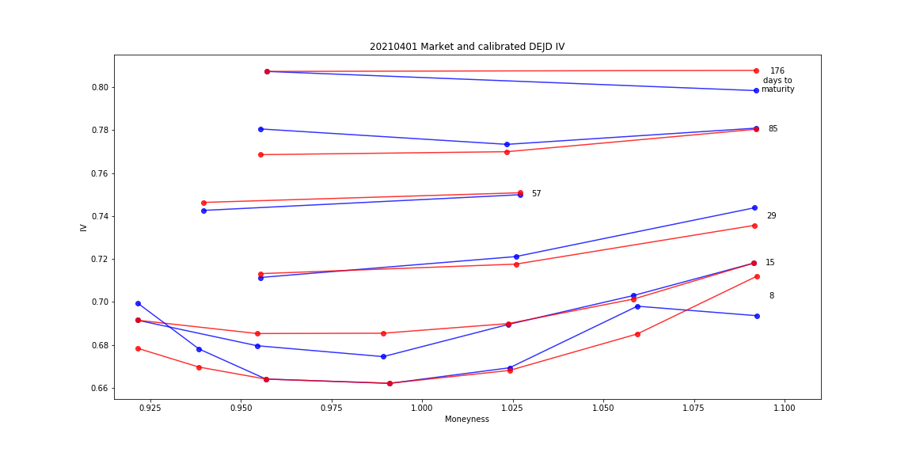

[](http://quantlet.de/)

## [](http://quantlet.de/) **fit_IV_DEJD** [](http://quantlet.de/)

```yaml

Name of QuantLet: fit_IV_DEJD

Description: Fit market IV surface by double exponential jump diffusion model

Keywords: p2p, lending, crpyto, CP2P, interest rate, borrowing rate, stochastics, IV surface

Author: Francis Liu

Submitted: Oct 10 2022 by Francis Liu

```



### [IPYNB Code: fit_IV_DEJD.ipynb](fit_IV_DEJD.ipynb)


automatically created on 2022-10-14